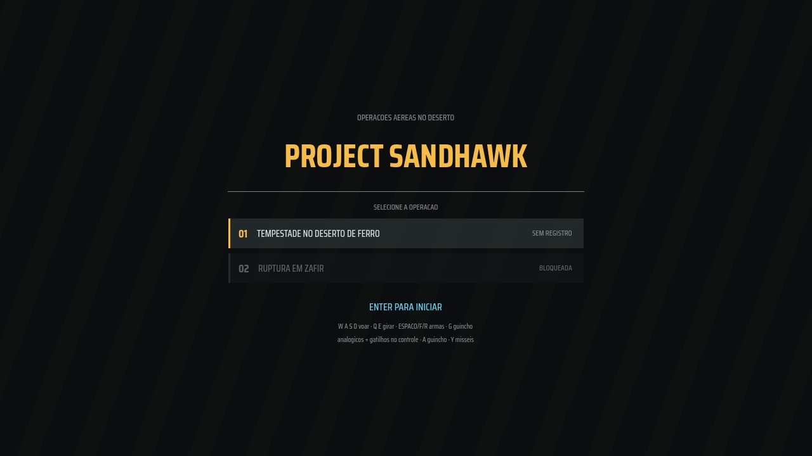
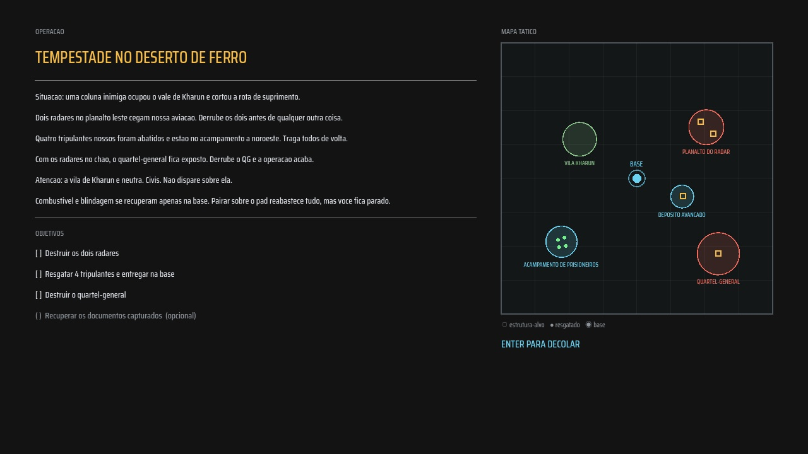
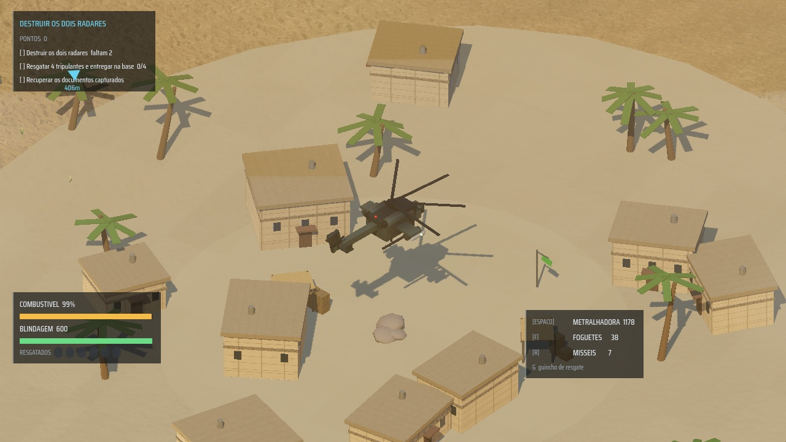
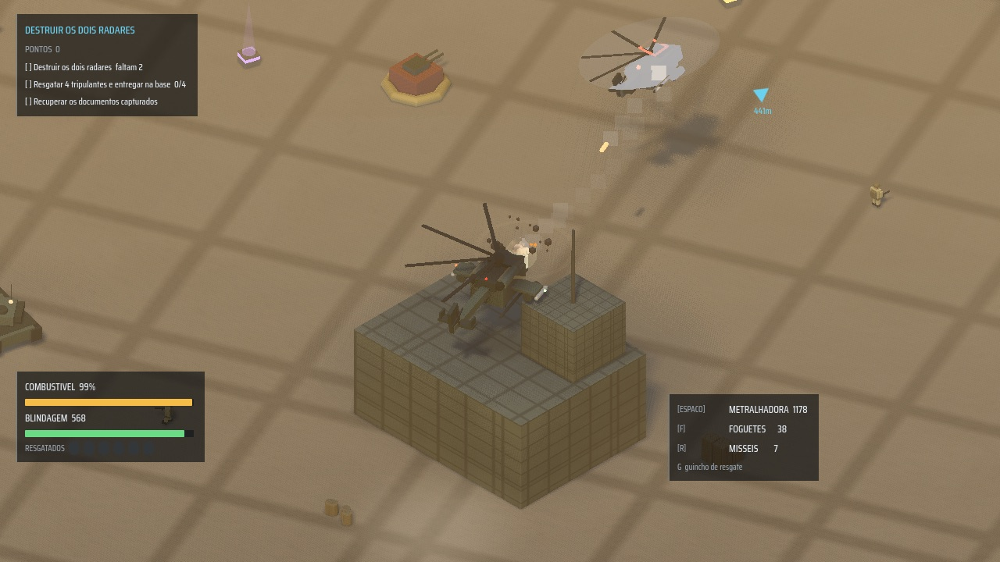
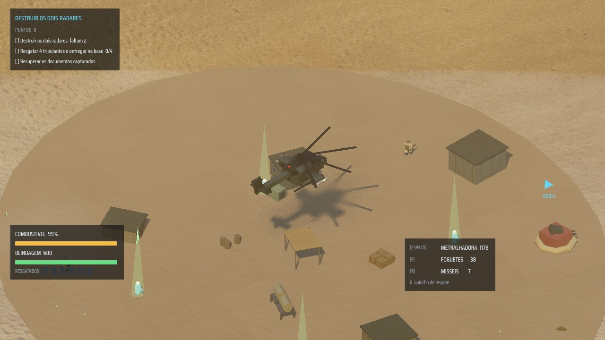

# 🚁 Project Sandhawk

> Remake espiritual de **Desert Strike** (Mega Drive, 1992) com gráficos, som e animações de 2026.
> Reimplementação clean-room em **Godot 4.7**: nenhum código, arte ou dado do jogo original.




---

## 📖 Sobre o projeto

Piloto um helicóptero de ataque sobre um deserto aberto: destrua radares e o quartel-general,
resgate tripulantes abatidos com o guincho e administre o triângulo **combustível · blindagem ·
munição** que definiu o original. O alvo não é clonar pixel a pixel, e sim reconstruir a
*sensação*: o peso do voo, a leitura tática do mapa e a tensão de decidir entre "mais um alvo"
e "voltar para reabastecer".

O projeto segue três princípios inegociáveis:

| Princípio | O que significa na prática |
|---|---|
| 🧼 **Clean-room** | Zero código, sprite, som, mapa ou dado da EA. Tudo reconstruído por observação de design |
| 🏭 **Procedural first** | Modelos 3D, VFX, terreno e **todo o áudio** são gerados em código. Só texturas e fonte vêm de fora, e apenas CC0/OFL |
| 📄 **Data-driven** | Armas, inimigos, missões e tuning vivem em `.tres`/`.json`. Criar missão nova não exige tocar em código |

---

## 📸 Screenshots

| | |
|---|---|
|  |  |
| *Briefing com mapa tático desenhado em runtime* | *Vila neutra: casas texturizadas, palmeiras e capim* |
|  |  |
| *Assalto ao QG sob fogo de helicóptero inimigo* | *Acampamento de prisioneiros: os faróis verdes são resgates* |

---

## ⬇️ Baixar e jogar (sem instalar nada)

Baixe a versão pronta na [página de **Releases**](https://github.com/JVLegend/desert-strike-rebuild/releases):
não precisa de Godot, nem de git, nem de conhecimento técnico.

### 🪟 Windows

1. Baixe `ProjectSandhawk-vX.X.X-windows.zip` e **extraia a pasta** (botão direito → Extrair tudo).
2. Dê dois cliques em `ProjectSandhawk.exe`.
3. Na primeira vez o Windows SmartScreen pode avisar "aplicativo não reconhecido":
   clique em **Mais informações → Executar assim mesmo**. Isso acontece porque o
   executável não tem assinatura digital paga, não porque haja algo errado.
4. Importante: o `ProjectSandhawk.pck` precisa ficar **na mesma pasta** do `.exe`.

### 🍎 macOS

1. Baixe `ProjectSandhawk-vX.X.X-macos.zip` e dê dois cliques para extrair.
2. Na primeira vez, **não** dê dois cliques direto: clique com o **botão direito
   no `ProjectSandhawk.app` → Abrir → Abrir**. Isso registra a exceção do Gatekeeper.
3. Se o macOS ainda disser que o app "está danificado" (acontece em versões novas
   do sistema com apps sem assinatura da Apple), rode uma vez no Terminal:

   ```bash
   xattr -cr ~/Downloads/ProjectSandhawk.app
   ```

   e abra normalmente depois. O aviso existe porque o app não é assinado/notarizado
   pela Apple (isso custa uma conta de desenvolvedor), não porque haja risco.

> 🐧 **Linux:** ainda não há build pronto, mas o jogo roda perfeitamente pelo
> código-fonte (seção seguinte).

---

## 🛠️ Rodar pelo código-fonte (desenvolvedores)

**Requisito:** [Godot 4.7+](https://godotengine.org/download) (no macOS: `brew install godot`).

```bash
git clone https://github.com/JVLegend/desert-strike-rebuild.git
cd desert-strike-rebuild/project
godot --headless --import   # primeira vez: gera o cache de importacao
godot                        # roda o jogo
```

O repositório é autossuficiente: as texturas e fontes já vêm versionadas em `project/assets/`
e todo o resto (modelos, áudio, VFX, terreno) é gerado em código no boot. Clonou, importou, jogou.

### Controles

| Ação | ⌨️ Teclado | 🎮 Controle (Xbox) |
|---|---|---|
| Voar | `W` `A` `S` `D` ou setas | Analógico esquerdo |
| Girar (yaw) | `Q` / `E` | Analógico direito |
| Metralhadora | `Espaço` | `RT` |
| Foguetes | `F` | `LT` |
| Mísseis teleguiados | `R` | `Y` |
| Guincho de resgate | `G` (segurar) | `A` (segurar) |
| Avançar telas | `Enter` | `A` |
| Reiniciar missão | `F5` | — |

---

## ✨ O que existe hoje

### 🚁 Voo e câmera
Física arcade com inércia e derrapagem; banking e pitch puramente visuais; rotor principal e de
cauda animados; sombra projetada por `Decal` como âncora de altitude. Câmera isométrica
ortográfica com amortecimento crítico, *look-ahead* pela velocidade e screen shake por trauma.

### ⚔️ Combate
Três armas data-driven (hitscan com dispersão, foguetes com dano em área, mísseis com
perseguição) e mira assistida "grudenta" em cone de 12°, sem a qual combate isométrico vira
adivinhação de profundidade. Projéteis usam raycast de segmento: sem tunelamento em alta
velocidade.

### 💀 Seis tipos de inimigo
| Inimigo | Papel |
|---|---|
| 🪖 Soldado | Infantaria que persegue, atira e foge com 1 HP; pernas animadas pela velocidade real |
| 🛻 Picape armada | Rápida e frágil; **orbita** na distância de tiro em vez de parar de frente |
| 🛡️ Tanque | Lento e blindado, tiro pesado com splash; para de andar para atirar, cano com recuo |
| 🚁 Helicóptero | Único que persegue em 3D; ao morrer **cai girando** e explode no impacto |
| 💥 Canhão AAA | Torre fixa que trava a mira com linha de visada e dispara rajadas |
| 🎯 Lançador SAM | Míssil teleguiado lento: despistável quebrando a linha de visada atrás de obstáculos |

### ⛽ Recursos e resgate
Combustível drena continuamente (alarme, queda no zero); blindagem sem regeneração; munição
por arma. O guincho prende o helicóptero no lugar por 4 segundos: é o momento de maior tensão
do jogo. A base amiga reabastece devagar e de propósito, criando janela de vulnerabilidade.

### 🗺️ Campanha e missões
Duas missões com **save automático** de progresso, recordes de pontuação e tempo. Cada missão é
um JSON que descreve o mapa inteiro: zonas, estruturas, inimigos, resgatados, pickups e
objetivos com desbloqueio encadeado. Briefing com mapa tático, debriefing com tempo contra o par.
A vila neutra pune quem atira nela.

### 🎨 Visual
Terreno de deserto gerado por ruído com shader próprio de areia (textura CC0 + normal mapping +
ondulações de vento procedurais); iluminação ACES com bloom, SSAO, SDFGI e névoa volumétrica;
2.600 tufos de capim + 420 arbustos em **2 draw calls** via MultiMesh, distribuídos por ruído
de aglomeração; explosões em 8 camadas (clarão, bola de fogo, onda de choque, fumaça, destroços,
faíscas, queimado no chão, coluna persistente); zonas decoradas com casas, tendas, barricadas
e trilhas de veículo.

### 🎵 Áudio 100% sintetizado
Nenhum arquivo de áudio no repositório: os **16 efeitos** nascem amostra por amostra em GDScript
(rotor com pitch ligado à velocidade, armas, explosões por tamanho, alarmes) e a **trilha é
composta num tracker próprio**: 132 BPM em ré menor, baixo em serra, melodia em onda quadrada e
bateria sintetizada, no espírito FM dos consoles de 16 bits. Duas camadas do mesmo tema fazem
crossfade conforme o "calor de combate".

---

## 🏗️ Arquitetura

```text
project/
├── actors/        # helicoptero do jogador, inimigos, projeteis, pickups, POWs
├── assets/        # UNICOS arquivos de terceiros: texturas CC0 + fonte OFL (ver CREDITS.md)
├── audio/         # sintese de SFX e o tracker musical, tudo em codigo
├── data/          # .tres de armas/inimigos/tuning e .json de missoes e campanha
├── game/          # raiz do fluxo (titulo -> briefing -> voo -> debriefing) e autoloads
├── tools/         # smoke tests headless, sonda de performance, captura de tela
├── ui/            # HUD, menu de titulo, briefing, debriefing, tema
├── vfx/           # explosoes, tracers, decals, particulas
└── world/         # terreno procedural, vegetacao, zonas, props, base amiga
```

Decisões de arquitetura e a estratégia completa estão em [`docs/`](docs/):
[MASTERPLAN](docs/MASTERPLAN.md) · [DECISIONS](docs/DECISIONS.md) ·
[PLANO_EXECUCAO_2026](docs/PLANO_EXECUCAO_2026.md) · [LEGAL_AND_ASSETS](docs/LEGAL_AND_ASSETS.md)

---

## 🧪 Validação

O projeto roda **sem cabeça** para CI e verificação local:

```bash
cd project
godot --headless --import                              # obrigatorio apos criar class_name novo
godot --headless --check-only --quit                   # sintaxe
godot --headless --script tools/combat_smoke_test.gd   # ~15 grupos de teste ponta a ponta
godot --headless --quit-after 300                      # boot real, 5 s sem erro
godot res://tools/capture_screenshot.tscn -- saida.png briefing   # captura de tela
godot res://tools/perf_probe.tscn                      # custo por efeito visual em ms
```

O smoke test exercita o caminho real: missão carregada, mundo montado, tiro consumindo munição,
mira travando, inimigo morrendo, resgate completo com entrega na base e objetivos destravando
em cadeia. A sonda de performance mede **custo em ms × diferença visual em % de pixels** por
efeito, e é ela que decide o que fica ligado (o SSIL, por exemplo, foi cortado por custar 16%
do frame para mudar 0,25% dos pixels).

---

## 📜 Assets e licenças

Política estrita, documentada em [`project/assets/CREDITS.md`](project/assets/CREDITS.md):

| Asset | Origem | Licença |
|---|---|---|
| Texturas de areia (cor, normal, rugosidade) | [ambientCG Ground054](https://ambientcg.com/view?id=Ground054) | CC0 1.0 |
| Fonte Saira Condensed (Medium, Bold) | [Google Fonts](https://fonts.google.com/specimen/Saira+Condensed) | SIL OFL 1.1 |

Todo o resto — modelos 3D, áudio, VFX, shaders, terreno, design de missão — é **autoral e
gerado em código**. Nada do jogo original da EA está ou estará neste repositório; "Desert
Strike" é citado apenas como referência de design. Nome comercial definitivo pendente de
revisão de marca.

---

## 🗺️ Roadmap

- [x] Protótipo de voo e câmera com gate de playtest
- [x] Combate, recursos, resgate e vertical slice completo
- [x] Passe visual e sonoro "2026"
- [x] Campanha com 2 missões, save e menu de título
- [ ] ⏳ Playtest de balanceamento com terceiros (os números vieram da spec, não de jogo)
- [ ] Menu de pausa (ESC) e flash direcional de dano no HUD
- [ ] Missões 3+ e novos biomas (o sistema de missão por JSON já suporta)
- [ ] Export públicos assinados para macOS/Windows

---

## 🤝 Créditos

Projeto pessoal de **João Victor Dias** ([@JVLegend](https://github.com/JVLegend)), construído
em pareamento com Claude (Anthropic). Inspirado no design de *Desert Strike: Return to the
Gulf* (Electronic Arts, 1992), sem afiliação com a EA.
